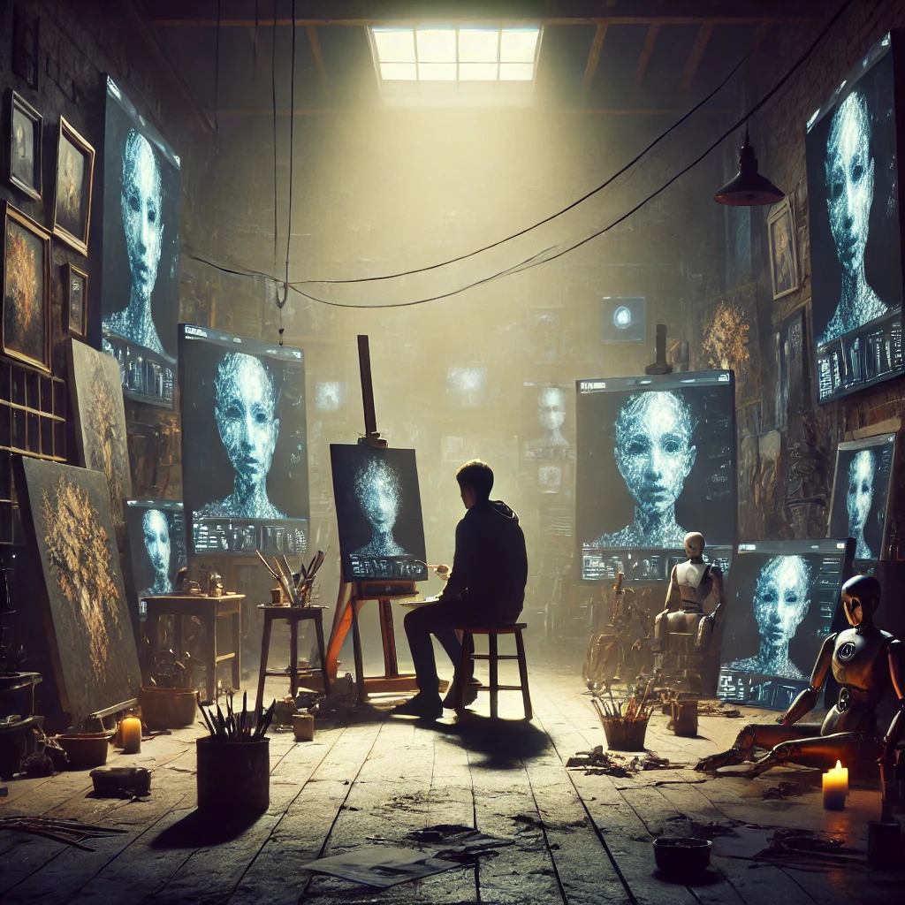

# Art Has No Value

[return to the light](/posts/how/how/)
The world is suffocating under the weight of content—  
Articles no one reads. Ads that scream into the void. Clickbait clutter. And now, with AI’s rise, the internet is collapsing under a tsunami of synthetic art and hollow words.

We drown in a sea of meaningless noise. The question isn’t how to stand out, but whether standing out matters anymore. When machines create faster than we ever could, what’s left for us? What happens when **everything becomes disposable?**

## The Creator’s Curse

For some, creativity is a gentle, fleeting breeze. For others, it’s a relentless torment—a gnawing hunger that can never be satisfied. It screams inside your head, demanding release. But the release is temporary. The moment you finish one piece, the void returns, blacker and deeper than before.

So you create again. And again. You throw everything into the fire of creation, only for the flames to consume you. You stare at what you’ve made and ask yourself the same question:

**Why? What’s the point?**

The answer? **There isn’t one.** Creativity is a ritual we repeat to stave off despair. And when AI can churn out art without thought, without pain, without soul—our efforts become a grotesque parody. The act of creation is no longer sacred. It’s just noise added to noise.

## The Hollow Divide

There are two types of creatives in this world:  
- Those who create out of compulsion, cursed to bleed for their work.  
- And those who simply want to produce—a byproduct of narcissism and vanity, not love.

AI is the ultimate tool for these hollow producers. It gives them the ability to flood the world with lifeless, meaningless content. Art as noise. Art as spam. Art as **soulless consumption**.

True creators won’t be replaced, they say. Maybe not. But creators will be drowned. Drowned in synthetic content, suffocated until their voices vanish. And even if we adapt and use AI as our tool—**what does it matter?**

The canvas is already defiled.

## Art Is Theft, and Everything Is Theft

All art is stolen. We are thieves, scavenging from those who came before us. And AI? AI is merely the mirror that shows us the truth.

There’s no such thing as originality. Experience feeds into creation, and creation feeds into consumption. When art is infinite, **the value of art approaches zero.** Scarcity is a lie—a fabrication to keep the capitalist machine grinding forward.

## Manufactured Meaning, Manufactured Scarcity

They’ll say it’s theft. They’ll say AI steals from artists. But the real theft is **capitalism’s theft of the soul.** Art was devalued long before AI. Technology has always made art cheap—easy to copy, easy to reproduce, easy to strip of its essence and sell as a hollow product.

Copyright. NFTs. Intellectual property. All artificial walls erected to give art a false sense of worth. A facade of importance in a system designed to bleed creators dry.

The system demands artists sell their soul—or starve.

AI won’t destroy art. It will destroy **artists’ illusion of importance.** And that illusion was all we ever had.

## Art Isn’t Real

The world is a machine, and art is just another gear in its cruel, grinding cycle. The algorithm doesn’t care. Corporations don’t care. Artists fighting for authenticity while corporate overlords profit is the ultimate irony. The only ones who win are those who never cared for art in the first place.

## The Algorithm Owns You

We delude ourselves into believing we control our creations. But every piece we share, every click, every algorithmic adjustment—**it owns us.** We’re slaves to the system, feeding a monster we can never tame.

Art is dead. Not in the way we think—because it never truly lived. It’s an idea. A reflection. A broken mirror that can never show us the full truth.

AI will not kill art. AI will reveal what art has always been: a hollow commodity that we keep alive to feel less alone in an uncaring universe.

And so we create. Not for meaning. Not for purpose. But because we are prisoners of our own need to make noise.

Ask yourself—**is this the art you control, or is it the art that controls you?**