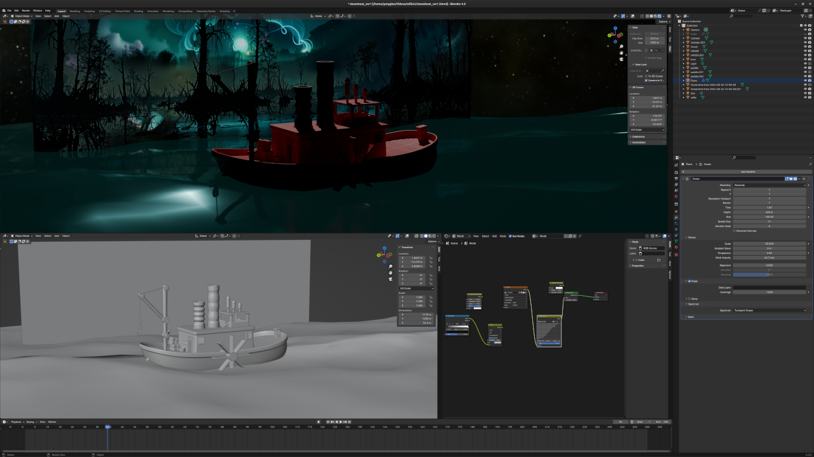

<iframe width="100%" height="468" src="https://www.youtube.com/embed/GS9bdSrCvfw?si=3-TWFDISeYHEQ7Bv" title="YouTube video player" frameborder="0" allow="accelerometer; autoplay; clipboard-write; encrypted-media; gyroscope; picture-in-picture; web-share" referrerpolicy="strict-origin-when-cross-origin" allowfullscreen></iframe>

### **The Melancholy adventures of Steamboat Willie: A Retrospective on the Project**

#### **Introduction**
This project started with a simple, somewhat cynical observation: if you create something entirely new and unique, the content often struggles to gain traction, while parodies or familiar characters tend to engage audiences more effectively and get attention. It’s a frustrating reality of creative work, and one I decided to lean ironically into. *Steamboat Willie* had just entered the public domain, and the idea of updating and colorizing it felt like a perfect blend of nostalgia and experimentation.

This blog post serves as a behind-the-scenes look at the project’s creation, from its conceptualization to its execution, and reflects on the lessons learned along the way.

---

#### **Concept and Motivation**

The decision to use *Steamboat Willie* as the foundation was strategic. The cartoon’s entry into the public domain provided an opportunity to showcase my editing and graphics ability. Additionally, Walt Disney’s controversial legacy and the Disney Corporation’s history of intellectual property theft made the project a target for parody and commentary.
The tension between critique and adoration felt like fertile ground to work with as well.

---

#### **Production Process**
The production of *Steamboat Willie* was a labor-intensive process that involved several stages:

1. **Initial (failed) Attempts**:  
   My first cut of the project was a straightforward edit of the original cartoon. I quickly realized that this approach was time-consuming and unsustainable. To streamline the process, I decided to break the project into smaller, bite-sized episodes, which could be released incrementally on social media and stitched together later.

2. **Rotoscoping and Colorization**:  
   Rotoscoping - tracing each character frame by frame - and the colorization was the bulk of the labor. It felt necessary to use original character lines to retain the charm of the original animation.
<iframe width="560" height="315" src="https://www.youtube-nocookie.com/embed/TlmBrhCwX_I?si=dH5iKUVLSFurjvSq&amp;controls=0&modestbranding=1&rel=0" title="YouTube video player" frameborder="0" allow="accelerometer; autoplay; clipboard-write; encrypted-media; gyroscope; picture-in-picture; web-share" referrerpolicy="strict-origin-when-cross-origin" allowfullscreen></iframe>

3. **Compositing and Backgrounds**:  
   New backgrounds were created or modified to fit the 16:9 aspect ratio, as the original 5:4 frames were too small. Some scenes required “outpainting” to fill in extended areas. Stock video from my recent trip to Alaska was used extensively to create these backgrounds.

4. **AI Integration**:  
   The underwater sequences featuring Black Pete utilized AI-generated visuals. These scenes were intentionally surreal and artificial. It was a cheeky nod to the idea of a “fake” world - serving as a meta commentary.

5. **Color Correction and Consistency**:  
   To unify the disparate visual elements, I applied extreme color grading across the entire project to ensure a consistent look and feel despite the varied sources of the footage.
<iframe width="560" height="315" src="https://www.youtube.com/embed/3rTQliK1MAU?si=SMEKRiJ_Rlmpq1oT&controls=0&modestbranding=1&rel=0" 
title="YouTube video player" frameborder="0" allow="accelerometer; autoplay; clipboard-write; encrypted-media; gyroscope; picture-in-picture; web-share" referrerpolicy="strict-origin-when-cross-origin" allowfullscreen></iframe>

6. **Sound Design**:  
  Squeaky toys, radio static, and a parakeet were used. Whale noises for the mermaid. Boat horn for the cow, The music was original, created using an MIDI keyboard and LMMS music studio.

---

#### **Themes and Narrative**
At its heart, the video was about life, loss, and acceptance. The steamboat, named *Charon* (after the ferryman of the dead in Greek mythology), symbolized life’s journey. The river it traveled represented the passage of time, leading the characters—and, by extension, the audience—toward the inevitable end.

Throughout the episodes, the characters grew increasingly detached from one another, reflecting the inevitability of separation and mortality. The emotional arc of the story was intended to evoke a sense of melancholy and introspection, contrasting sharply with the lighthearted expectations of the original cartoon.

---

#### **Challenges and Reflections**

- **Final Shots**:  These proved particularly challenging, requiring extensive reworking and eventually being condensed for the final cut.
<iframe width="560" height="315" src="https://www.youtube.com/embed/jGCAgHO-oCQ?si=4rYzPYcDph1ztXze&controls=0&modestbranding=1&rel=0" title="YouTube video player" frameborder="0" allow="accelerometer; autoplay; clipboard-write; encrypted-media; gyroscope; picture-in-picture; web-share" referrerpolicy="strict-origin-when-cross-origin" allowfullscreen></iframe>

- **Sustainability**: The sheer volume of labor involved in producing each episode made it clear that creating content of this scale solo was unsustainable.

- **Audience Reception**: While the project achieved moderate success (with an estimated 3,000 views across platforms - not bad, not viral), many viewers failed to pick up on the deeper themes and details embedded in the work. It highlighted the gap between creator intent and audience interpretation - something I see often.

---

#### **Technical Details**
For those interested in the technical aspects of the project, here’s a breakdown of the tools and locations used:
- **Filming Locations**: Portland, Oregon, and Kenai Fjords, Alaska.
- **Equipment**: Zoom H4N audio recorder, Panasonic GH6 camera with a Zeiss Flektogon 35/2.4
- **Software**: DaVinci Resolve (editing), Blender 3D (3D modeling), ComfyUI (AI generation), Audacity (audio editing).
- **Music**: Arturia KeyLab digital keyboard and LMMS music studio.

---

#### **Conclusion**
Looking back I’m appreciative of how much it taught me. It was a project born out of curiosity, frustration, and a desire to create something meaningful. It reminded me why I create: not for the views or the likes, but for the joy of bringing something into the world that didn’t exist, but needed to exist, and has a place in the world.

*“Remember me. I was.”*  
A poignant sentiment, one that captures the essence of *The Melancholy adventures of Steamboat Willie*. It’s a fleeting, imperfect, exploration of life, art, and memory. 
That’s enough.